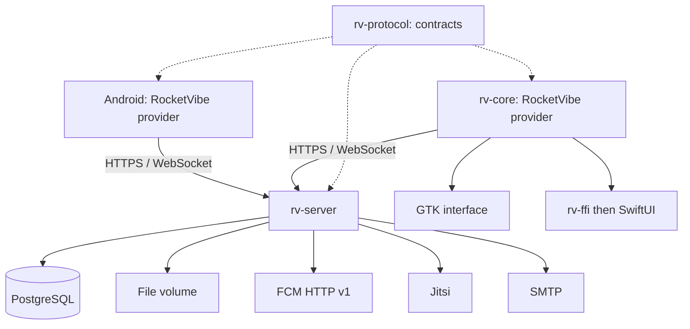

# RFC 0001: Standalone RocketVibe server in Rust

| Field | Value |
|---|---|
| Status | Native server and providers under development; E2EE J4 in progress, J5 qualification and migration / operations open |
| Date | 30 September 2026 |
| Scope | Server, protocol, Android / GTK / SwiftUI clients, Rocket.Chat migration |
| Repository state studied | `master`, commit `39b513a`; Android `0.4.0`, desktop `0.5.0` |
| Destination | Parity with the current features, operation without a Rocket.Chat server |

## 1. Summary

Add to the monorepo a RocketVibe messaging server in Rust, self-hostable,
with its own HTTP API and WebSocket protocol. The existing clients reach this
server through a new `rocketvibe` provider, while keeping the Rocket.Chat
provider. Both remain usable in the same app, per account, including after the
transition.

**Interface constraint:** the desktop and mobile clients keep their current
screens and components. The provider changes the transport, the data and the
capabilities; it does not create a new client or a parallel messaging client.

The server uses Axum, Tokio and PostgreSQL via SQLx. It carries accounts,
permissions, rooms, messages, files, the synchronization journal
and the notification tasks. Jitsi remains the call engine; FCM remains the Android
push channel. Their configuration becomes independent of Rocket.Chat.

The interface, the SQLite cache, drafts, media players and
offline operation stay in the clients. A shared protocol contract
reduces divergences between the Rust server, the Rust desktop core and Android.

Delivery proceeds by milestones. A first Android ↔ Windows exchange after a cut
and a restart validates the foundation, but is not final parity. Encryption,
notifications and import are part of the mandatory destination before the
cutover of an installation that uses them.

## 2. Problem and goals

RocketVibe has usable clients, but their features depend on Rocket.Chat APIs,
documents, settings and events. Hosting, protocol evolutions and part of the
synchronization behavior remain imposed by that server.

### Goals

1. Make the apps work without Rocket.Chat or MongoDB in the native deployment.
2. Keep the uses covered by the functional matrix of §4.
3. Guarantee resumption after a cut, crash and restart with no loss of an
   acknowledged message and no duplication of the same send intent.
4. Keep data, backups and settings under the administrator's control.
5. Allow a gradual transition and a controlled import of the existing data.
6. Provide the means to create accounts and rooms on a fresh installation.

### Out of scope for this RFC

- General compatibility with the official clients or Rocket.Chat extensions.
- Federation between servers, marketplace, omnichannel and enterprise directory.
- Web messaging client and full web administration console.
- iOS delivery, currently not validated in the project.
- Distributed cluster and multi-region deployment from the first version.
- Reimplementation of a video-conferencing engine or removal of FCM.

An instance hosts one workspace. Several instances can coexist
in an app. Client multi-server does not imply a multi-tenant SaaS server.

## 3. Actual repository state and reuse points

The findings below come from a reading of the repository, not from a new
execution of the apps. The recent changelogs and the parity tracker take precedence over the
old sections of the READMEs and the roadmap.

| Component | Finding | Consequence |
|---|---|---|
| Mobile: `lib/provider.ts` | `Provider`, `Translator`, `Listener` interfaces, actions and outboxes; `ProviderKind` contains only `rocketchat` | Extend a separation that has already begun |
| Mobile: `providers/rocketchat/` | First concrete adapter | Preserve its behavior and its tests |
| Mobile: auth, profiles, presence, push, E2EE and several screens | Rocket.Chat calls still direct | Complete the contract; adding a driver is not enough |
| Desktop: `rv-core` | UI-less core, Rust, Tokio, HTTP, WebSocket, SQLite | Introduce the providers into the core; do not move the network into GTK |
| Desktop: `rv-ffi`, GTK and SwiftUI | Two interfaces use the same core | Expose capabilities and new flows through `rv-ffi` |
| Normalization / rendering | Some local models and Markdown trees are still marked by Rocket.Chat | Translate at the boundaries and gradually neutralize the internal forms |
| Existing E2EE | Reading and writing with existing keys; creation of an encrypted room absent | Add a full key lifecycle to be autonomous |
| Current deployment | Rocket.Chat + MongoDB in `docker/compose.yml` | Add a distinct native Compose file; keep the Rocket.Chat bench |

The comments mentioning kChat / Mattermost describe an intention
to extend, not a second provider that has shipped. They are not
a dependency of the proposed server.

## 4. Target parity matrix

All the "parity" items below must be available on the RocketVibe provider
at final release. Assigning them to a milestone does not authorize dropping them.

| Domain | Native server | Client work | Target |
|---|---|---|---|
| Discovery, accounts and sessions | Instance identity, sign-in, revocable sessions, capabilities | New probe and provider selection | Parity |
| 2FA | TOTP, email codes; reauthentication for sensitive operations | Flows adapted to the native challenge | Parity of use, without reproducing the Rocket.Chat password digest |
| Multi-server | Stable instance identity | Isolated registries, sessions and caches | Parity |
| Public / private rooms and DMs | Members, roles, information, unique DM per pair | List, join, open a DM | Parity |
| Favorites, unreads, mentions | Personal preferences, read positions, counters | Sections, badges, navigation to unreads | Parity |
| History and real time | Pagination, durable journal, creations / edits / deletions | Translation, cache, resumption | Parity |
| Markdown, emojis, mentions, quotes | Source text, references, emoji catalog, structured system messages | Native rendering and normalization | Parity |
| Sending and drafts | Idempotent send, retrievable result | Persistent outbox; local drafts | Parity |
| Edit / delete | Authorizations, edit window, revisions, tombstones | Actions and failure states | Parity |
| Reactions, pins, starred messages | Idempotent operations; stars private to the user | Actions, lists and return to the message | Parity |
| Threads | Root, replies, counters, rights of the parent room | Thread view and composer | Parity |
| Presence and typing | Temporary states with expiry | Indicators and offline degradation | Parity |
| Search | Plaintext messages, authorized users and rooms | In-room search; local index for encrypted content | Parity adapted to E2EE |
| Photos, documents, videos and voice messages | Uploads, idempotent confirmation, protected files | Selection, compression, recording, playback, sharing | Parity |
| Link / video previews and integration cards | Bounded metadata, structured attachments | Existing cards and players | Parity of presentation; marketplace out of scope |
| Profiles and settings | Identity, avatar, bio, status, preferences | Cards, my profile, settings | Parity |
| Push and desktop notifications | Device registry and preferences; Android FCM | Native reception, navigation and reply; desktop notifications | Parity per platform |
| E2EE: existing messages and files | Opaque contents, wrapped keys and versions | Reading, sending, editing, threads, locking | Parity |
| E2EE: fresh installation | Key registry and membership management | Initialization, sharing and renewal of keys | Essential addition for autonomy |
| Jitsi calls | Creation, access control, meetings and tokens | Start, join, meeting information | Parity |
| Sharing and deep links | Native identifiers and permalinks | Android sharing, desktop paste / drop, link resolution | Parity |
| Languages, ergonomics, updates | Capabilities and structured errors | FR / EN, shortcuts, spell checker, app updates | Preserve the platform-specific features |
| Minimal administration | Bootstrap, invitations, deactivation, room creation, settings and audit | Operator CLI; necessary creation screens | Essential addition for autonomy |

Parity concerns the service rendered, not endpoint names or the anomalies of the
previous server. Example: a replayed upload confirmation must be idempotent.

Platform differences remain explicit: Linux currently quits on
close; the desktop receives no push when its process is stopped; SwiftUI
still has update and background gaps. This RFC does not declare them resolved.

## 5. Proposed choices and alternatives

| ID | Proposal | Rationale |
|---|---|---|
| D01 | Rust server, Axum / Tokio / SQLx | Consistency with the desktop core, explicit types, resource control |
| D02 | Versioned RocketVibe HTTP + WebSocket API | Master synchronization without reimplementing DDP and the Rocket.Chat conventions |
| D03 | Modular monolith, one application process | Simple operation; durable background tasks in PostgreSQL |
| D04 | PostgreSQL as the authoritative database | Transactions, constraints, journal, initial full-text search |
| D05 | Files on a local volume at first | Simple deployment; internal interface allowing object storage later |
| D06 | Jitsi and FCM kept | Reuse the existing flows and the specialized transports |
| D07 | Native and Rocket.Chat providers coexisting | Migrate gradually and keep a point of comparison |
| D08 | E2EE on the client side, never a decryption key in plaintext on the server | Preserve content confidentiality |
| D09 | Controlled import, no permanent bidirectional bridge | Reduce conflicts and make the cutover verifiable |

These choices are recommendations open for discussion. Dependency versions will
be fixed at implementation time on published versions, with lockfile,
toolchain and license verification; no development branch is required.

### Alternatives considered

**TypeScript / Node.** A good choice for quickly assembling an API and benefiting from
SDKs, but less consistent here with the Rust desktop core. Rust does not by
itself guarantee reliability: transactions and resumption rules remain indispensable.

**Rocket.Chat-compatible facade.** Reduces some client changes, but imposes
the documents, streams, settings and errors of the previous server. A limited facade
could be studied separately if keeping old binaries became mandatory.
Old clients will not be able to connect directly to the proposed protocol.

**Existing server, for example Matrix or Mattermost.** Relevant if the priority goal
is to change hosting while minimizing server development. It implies
a new feature mapping and keeps the dependency on another
product. Choosing our own server means taking on its maintenance and operation.

**Server-side SQLite, Redis, external search engine, microservices.** SQLite would be
conceivable for a small installation, but PostgreSQL here simplifies concurrent
transactions and durable tasks. The other services are added only after
a need is measured; Redis is not required by the first milestones.

## 6. Architecture and repository organization



```text
apps/server/                       Rust package rv-server, CLI and SQL migrations
crates/rv-protocol/                 Rust contract independent of GTK, SQLite and SQLx
docs/protocol/                     Specification, schemas and conformance examples
docs/rfcs/                         Architecture proposals
docker/compose.rocketvibe.yml       Native environment, distinct from the Rocket.Chat bench
scripts/                           Import and operator tools
apps/mobile/providers/rocketvibe/
apps/desktop/crates/rv-core/        Native adapter and provider interface
```

The desktop workspace stays in place at first. `rv-protocol` is an
independent package consumed by path dependency; the CI verifies each consumer.
It does not take over the desktop's product version. Merging the Rust workspaces is
a later maintenance decision, not a prerequisite for this RFC.

`rv-server` contains accounts, rooms, messages, files, synchronization,
notifications, E2EE, calls and administration modules. Their business logic depends neither on Axum
nor on the Rocket.Chat shapes. The routes validate input, call the domain and
produce the protocol DTOs. The SQL transactions carry the invariants.

`rv-protocol` shares the exchange types, errors, capabilities and versions. The
exported schemas are used to generate the TypeScript types and to validate data at
runtime. The JSON examples and the conformance fixtures are run by both
clients. Sharing types does not authorize the client to enforce the server's rights.

The server does not depend on all of `rv-core`. Caches, local sessions, outboxes
and reconnection engines are client responsibilities. The rules that are truly
common may be extracted separately once identified.

## 7. Data model and invariants

| Set | Main data |
|---|---|
| Instance | Stable identity, data generation, protocol version, settings |
| Accounts | Users, hashed passwords, 2FA factors, invitations, recovery tokens |
| Sessions and devices | Revocable sessions, installation, platform, FCM token, last activity |
| Rooms and memberships | Type, name, topic, announcement, description, members, roles, favorites, read state |
| Messages | ID, author, room, thread root, plaintext or encrypted content, position, revision |
| Actions | Unique reactions, pins, personal favorites, deletions |
| Files | Upload, state, stored object, size, type, fingerprint, attachment to the message |
| Synchronization | Transactional counter, durable events, tombstones, temporary snapshots |
| Tasks | Push, email, previews, cleanup; attempts, deadlines, leases |
| E2EE | Public identities, encrypted backups, key versions, per-member envelopes |
| Operations | Meetings, emoji catalog, import operations and administration journal |

Mandatory invariants:

- Opaque identifiers, represented as strings. Keep the historical identifiers
  when possible; do not impose UUID on all the existing caches.
- UTC dates in RFC 3339; long revisions and positions transported as decimal
  strings to avoid JavaScript rounding. Client clocks do not order the sync.
- A two-party DM is unique per normalized pair of accounts, including under concurrent creation.
- A thread reply belongs to the same room as its root. Rights come from the room.
- A reaction is unique per message, account and emoji; repeating its removal has no effect.
- A message favorite is private to the account and absent from the events sent to others.
- Read positions advance monotonically per account and room. An edit
  or a reaction does not automatically turn an old message into a new unread.
- The rules on own messages, others' messages, read-only rooms and
  edit windows are verified at server transaction time.
- Deletions stay represented long enough to catch up the disconnected clients;
  beyond that, a cache rebuild is imposed.

The counter policy distinguishes root messages, thread replies and mentions.
It must be documented and tested with both clients before milestone J2; its
default behavior targets the existing badges, without copying an observed inconsistency.

## 8. HTTP protocol and discovery

An anonymous discovery route, `GET /.well-known/rocketvibe`, exposes `product`,
`instance_id`, `data_epoch`, the server version, the accepted protocol versions,
the API base URL and the available sign-in methods. It exposes no secret.

Clients probe RocketVibe and, in the absence of a native identification, use the
existing Rocket.Chat probe. An explicit native incompatibility must not cause
a silent fallback to Rocket.Chat. Discovered origins are validated; no
token is transferred automatically to a new origin.

An instance announces effective capabilities: `threads`, `reactions`, `search`,
`uploads`, `typing`, `presence`, `push`, `e2ee`, `calls`, file limits and edit
rules. A capability that has not shipped stays disabled in the intermediate pilots.
The user's own permissions are fetched after authentication.

### Proposed surface: indicative paths to be fixed at milestone J0

| `/api/v1` surface | Operations |
|---|---|
| `/auth/*` | Login, 2FA challenge / verification, renewal, logout, recovery |
| `/me`, `/sessions`, `/devices` | Profile, preferences, sessions, devices and push |
| `/users`, `/users/{id}` | Authorized search and profiles |
| `/rooms`, `/rooms/{id}` | Creation, list, information, settings and memberships |
| `/direct-messages` | Open or create a DM idempotently |
| `/rooms/{id}/messages` | Paginated history, send and search |
| `/messages/{id}` | Targeted read, conditional edit and deletion |
| `/messages/{id}/replies` | Thread and replies |
| `/messages/{id}/reactions`, `/pin`, `/star` | Actions by explicit add / remove |
| `/rooms/{id}/read`, `/favorite` | Read position and personal preference |
| `/uploads`, `/uploads/{id}/complete`, `/files/{id}` | Preparation, transfer, confirmation and reading |
| `/sync/*` | Initial snapshot and change journal |
| `/e2ee/*`, `/calls/*`, `/emoji` | Wrapped keys, conferences, catalog |

The names are a contract proposal, not a list of implemented endpoints.
The protocol distinguishes server capabilities from account authorizations.

Each error contains a stable `code`, a `request_id` and bounded structured
details. The UI translates the code. `401` means session absent, expired or revoked;
`403` action refused, `409` conflict / idempotency key reused differently, `429`
rate limiting with a retry delay. A 2FA challenge is an explicit authentication
step, not a reason to delete an existing session.

Compatible changes are additive. A break requires a new major protocol
version, a support policy and a migration. An unknown mandatory event forbids advancing
the cursor: the client asks for an update.

## 9. Real time, resumption and event ordering

### 9.1 Authoritative journal

The WebSocket is a delivery accelerator; PostgreSQL and the durable journal
remain the authority. The message and its event are recorded in the same
transaction. The server answers "sent" only after commit.

An ordinary SQL counter (`BIGSERIAL`) does not guarantee commit order: a
transaction can obtain a small position and then finish after the next one.
The first implementation proposes an instance transactional sequencer:

1. Take the business locks in a documented order and apply the operation.
2. Lock the sequencer row, allocate the positions and insert the events.
3. Acquire no further business lock after the sequencer; commit immediately.
4. The broadcaster reads only committed events and can resume after a crash.

The lock is held until commit: a published cursor cannot go past a
still-invisible event of lower position. This choice serializes a short
part of the writes and will have to be measured. A future change of strategy keeps
the resumption contract and requires the same concurrency tests.

Each event contains a version, a type, an identifier, a target, its
revision and the data needed for the update. Additions, edits,
deletions, rights, reads, favorites and key versions are durable.
Presence and typing are temporary, expire and do not inflate the journal.

### 9.2 Initialization and reconnection

The client fetches a bounded snapshot with a coherent watermark. The initial version
captures, in a single consistent-view transaction, the authorized rooms, memberships,
counters and recent messages with the journal position. If several pages are
needed, they come from this immutable materialized snapshot, with limited duration and size,
and not from successive reads of a moving state.

Older history is loaded separately by keyset pagination `(position, id)`.
Revisions prevent an old page from overwriting a more recent event.

The WebSocket uses a short connection ticket obtained over authenticated HTTP,
consumable once, with no durable session token in the URL. The client presents
its cursor; the server fixes a catch-up bound, replays up to that bound,
then continues reading the journal. Any bounded memory queue that overflows triggers
a reconnection and a resumption, never the silent dropping of events.

Delivery is **at least once**. The client applies the events and writes
the cursor in the same SQLite transaction; it deduplicates by identity and revision.
The cursor is opaque, bound to the account, the instance and the data generation.
Internal numbers and events of inaccessible rooms are not exposed.

A stale cursor or a backup restoration that changes the generation triggers
`sync_reset_required`. The client rebuilds the server data without erasing the
drafts or the local send intents; these are then reconciled.

### 9.3 Access and revocation

Historical reads, snapshots, replays, broadcasts, searches and files
apply the same rights. A revocation invalidates the affected subscriptions and snapshots,
produces a minimal removal event and has the room cache purged
in the cooperating client. The server re-verifies rights before delivery; no
new room payload follows the revocation event on a connection.

The history limits when a member arrives are an explicit setting. Encryption
additionally requires possessing the right key versions.

A revocation cannot erase contents already downloaded on a device
that does not cooperate. The guarantees concern future accesses and, after rotation,
new encrypted contents.

## 10. Idempotent send and files

### Messages and actions

The client generates a persistent operation identity before the optimistic display.
The server deduplicates in an SQL constraint on `(account, operation_id)`, keeps
the request fingerprint and the result. Same key and same request return the same
result; same key and a different request produce an explicit conflict.

For messages, the client identity is kept or explicitly linked to the canonical
ID. After a lost response, the client can retrieve the result of its
operation. The identity of a deleted message stays reserved: replaying an old
send must not resurrect it after the journal is cleaned up.

Edits carry an expected revision. Favorites and reactions use
"set / remove" rather than an ambiguous toggle on replay.

### Files

1. Create an authorized upload for a room and a send intent.
2. Transfer into a temporary file with size, time and rate limits.
3. Check the actual size and the transfer integrity; for plaintext, verify
   the allowed types. Encrypted content stays opaque, its declared MIME is not proof.
4. Finalize the durable object before referencing its bytes in a committed message.
5. Idempotently confirm the upload and create the message / its events in a transaction.

A replayed confirmation returns the same message. An interruption after the bytes are
written but before the SQL commit can leave an orphan, handled by reconciliation
and cleanup; no successful commit must reference a non-finalized object.

An interrupted transfer can be restarted without recreating a message. A true
chunked resumption is a later optimization, not a promise of this first
protocol. Clients keep progress, retry and abandon.

Downloads verify access to the room. Protected previews and avatars do not
send credentials to a third-party origin. Link metadata requests
refuse private networks / loopback and re-verify DNS and redirects,
with size and time limits. Files are served by streaming.

## 11. Accounts, permissions and administration

Bootstrap is a local command for explicit use that creates the first
administrator without a default password. Public registration is disabled
by default; invitations make a fresh installation usable.

Initial proposal: passwords stored with Argon2id and parameters measured on
the host, opaque per-device sessions whose secrets are hashed on the server side,
expiry and renewal with rotation. Renewal remains compatible
with an app that has been offline for a long time: expiry clearly displayed, outbox preserved.

TOTP, recovery codes and email codes are supported. Email codes are
ephemeral, single-use and limited in attempts / resends. TOTP secrets are
protected by an operator key distinct from the data; this key is part of the
backup plan. Reauthenticating by password is not presented as an independent
second factor.

A change of email, password, 2FA factor or sensitive permissions requires
a recent session or an explicit challenge. Sign-in recovery does not automatically
recover a lost E2EE key.

Proposed roles: instance administrator, room owner / moderator,
member. Permissions are tested server rules, exposed to the client as
a rendering aid. Room creation, invitation, exclusion, editing others' messages and file access
are distinct actions.

An operator CLI covers accounts, invitations, deactivation, rooms, members,
settings, import and health status. The user flows for creation / joining
must be available in the apps for the corresponding rights. A full web
console may come later. The administrator does not read encrypted rooms
by virtue of the role alone.

## 12. Notifications, search and calls

### Notifications

Each eligible event produces a durable task in the business transaction.
Workers use leases and bounded retries; no network send is made
inside the SQL transaction. Devices, preferences, mentions, presence and read
positions determine eligibility. The reply to a notification is a normal
authenticated and idempotent send.

The server speaks FCM HTTP v1 with operator credentials. The payload carries
instance, room, message and notification identity, with no credentials or encrypted
content. For plaintext, the initial preference remains a generic notification with
authorized retrieval of the content, as in the project's current intention.

The native Android module must be adapted: provider type, session, retrieval endpoint
and payload format, not just the TypeScript code. Logout
revokes the device; invalid tokens are purged. A crash after the FCM send but
before acknowledgement can cause a replay: clients and notifications deduplicate.
Reception on a device cannot be guaranteed by the server alone.

Desktop notifications come from the real-time provider while the app runs.
Background management remains specific to each platform.

### Search and rendering

PostgreSQL carries full-text search of plaintext messages, with a filter on authorized
rooms applied before returning results. Users and rooms do not reveal
private spaces without permission. The server does not index the plaintext of E2EE rooms.

Clients maintain, after unlocking, a local index of the available encrypted
content. The UI states that the results concern the downloaded history.
The index must follow locking, deletion and the local retention policy.

The native protocol exposes the source Markdown text and the typed metadata, without
depending on the Rocket.Chat `md` format. The renderers are adapted; a common corpus
tests quotes, code, lists, mentions and emojis on Android / GTK / SwiftUI.

### Calls

The server associates a Jitsi meeting with the room, checks access on each
join request and issues short tokens limited to the meeting, with a Jitsi instance
configured to verify them. The public link does not contain the participant's token.
Secrets and conference creation belong to the server.

Token expiry does not guarantee the expulsion of an already connected participant:
this behavior will have to be verified with Jitsi and its moderation. Message
encryption does not mean that call media is end-to-end encrypted;
no common promise is made without specific validation.

## 13. End-to-end encryption

### What exists and what is missing

Mobile and desktop know how to use the historical Rocket.Chat formats, open
protected private keys, read wrapped room keys and encrypt messages
and files. They do not yet provide a complete autonomous lifecycle for creating and
sharing keys. Moving `e2e.fetchMyKeys` into a new server is insufficient.

### Target requirements

- Clients generate the keys; the server never receives a private key, room key
  or E2EE password in plaintext.
- The server stores public keys, encrypted private backups and room key
  envelopes for the authorized recipients only.
- Initialization, new devices, recovery by user secret,
  member addition and rotation on removal have explicit flows.
- Keys are versioned: a rotation does not destroy those needed for
  the authorized history; former members do not obtain the new keys.
- A locked send waits. A rotation makes a send prepared with an old
  version obsolete; the client re-encrypts it with a new operation identity
  if the old request was refused, after verifying its result.
- Native formats use authenticated encryption and established libraries.
  Inherited formats stay reserved for compatibility / migration.
- No text, encrypted file name, key or decrypted content goes into the logs,
  server previews or notifications. The metadata needed for routing stays visible.
- Quotes and previews of encrypted messages are built on the client side after
  decryption. Quoting in another room does not automatically transmit the plaintext
  or a key to different members; this sharing requires an explicit action.

The exact format, the authentication of public identities, resistance to a
key substitution by the server, lost devices and protection of
new contents after a compromise require a dedicated E2EE specification.
This RFC claims neither forward secrecy nor equivalence with an audited protocol.
The choice between a controlled extension of the current mechanism and a proven
group protocol is open and blocks the full exit of J4.

The dedicated work is now described in [RFC 0002](0002-e2ee-native.md):
MLS prototype in Rust, identity / devices and private persistence to be validated,
with a distinct recoverable archive. This working choice enables no capability
and does not lift the review and qualification conditions of J4.

The local caches already contain plaintext after decryption. An explicit
locking / purge policy, including the search index, is necessary;
"locking" must not be presented as disk encryption.

### Encrypted migration

Import the blobs and files without decrypting them on the server side. Preserve the
historical cryptographic identities and parameters, notably the UID used
as salt by the old envelopes. A display ID mapping must
not implicitly change these parameters.

The reconnected account must be able to open its old keys from a new
client, not only from a device that still has its cache. If the
source does not allow exporting the necessary envelopes and parameters, the room
stays explicitly non-migratable until an authorized client procedure. The migration
does not promise to restore a history whose keys are lost.

## 14. Client adaptation

### Android

Add `rocketvibe` to `ProviderKind` and to the registry. Extend the contract to secondary
reads, auth, discovery, profiles, presence, emojis, push, E2EE and calls.
The new provider implements its transports, normalization, send and catch-up.
The UI keeps its SQLite projection and consults the neutral capabilities / rights.

Do not fabricate fake Rocket.Chat documents in the server to satisfy the
screens. Neutralize or translate the local models that are still specific, including
Markdown, quotes, permissions, room flags, files and errors.

Preserve the send identities; gradually replace arbitration by dates
with the native revisions. The Rocket.Chat adapter keeps its temporal semantics.
A local migration must handle histories and outboxes that already exist.

### Desktop and SwiftUI

Introduce a provider interface in `rv-core`: auth, actions, reads,
sync, files and capabilities. The Rocket.Chat driver encapsulates the current
behavior; the native driver consumes `rv-protocol`. Extend `rv-ffi` to expose kind,
capabilities and new flows; validate GTK and SwiftUI separately.

### Identities and links

Separate the data by provider, origin, instance and account. Old sessions
without a kind stay Rocket.Chat. A native instance replacing a server
at the same URL does not automatically recover its session or credentials.

The `rocketvibe://room/...` links stay recognized (`salon/` still parses). The new permalinks
identify instance and room; the old imported links go through the
mapping table. An external link does not arbitrarily choose a session to reuse.
A service's canonical URL can change, but requires an explicit reconnection.

## 15. Import, cutover and rollback

The import is a resumable tool: read-only source, manifest, source version,
checkpoints, fingerprints and a table `(source, type, id) → native id`. Replaying
the same batch creates no additional account, DM, message or file.

| Object | Proposed handling |
|---|---|
| Accounts | Preserve useful identities; invitations / sign-in reset by default |
| Sessions, 2FA and push tokens | Do not import; reauthentication and re-registration |
| Rooms / members / roles | Explicit mapping, report of non-translatable permissions |
| Messages / threads / quotes | Keep dates and authors; rebuild references and counters |
| Reactions / pins / favorites | Import the states and their personal scope |
| Files / avatars / emojis | Copy the bytes, verify size and fingerprint; rewrite references |
| Reads / preferences | Import the available items and flag the absences |
| E2EE | Import envelopes and blobs, preserve the cryptographic parameters |
| Meetings and integrations | Keep the history; reconfigure secrets and services separately |

Feasibility depends on export rights and the source version. The tool produces
a full report of omissions, never a global success hiding lost data.

Cutover procedure:

1. Back up the source and test its restoration; identify the pilot accounts and rooms.
2. Perform a rehearsal import and compare accounts, references, files and E2EE samples.
3. Validate Android, GTK and SwiftUI, including native push and devices reconnected without the old cache.
4. Warn the users, have their outboxes emptied or handled, put the source
   in read-only mode and capture a coherent final export.
5. Import the final changes; if the source provides no reliable delta,
   redo a coherent read with deduplication and detection of deletions.
6. Reconcile, have the clients reconnect to the new provider and reopen writes.
7. Keep the source archived until a period decided before cutover expires.

Before native writes open, returning to the source stays simple.
After, restoring a URL is not enough: the new messages would be lost.
Native writes must be frozen and their deltas exported / reconciled, or the
cutover declared final after validation. No automatic rollback is promised.

During the pilot, coexistence means two distinct accounts / services, not
a bidirectional synchronization of each conversation. The source of truth
of a room stays unique.

## 16. Operations and backups

The initial deployment comprises the server binary, PostgreSQL, a file volume
and an HTTPS reverse proxy. Jitsi is optional for the initial milestones, mandatory
for an installation declaring calls; SMTP is necessary for the email flows.
FCM requires a project and credentials specific to the operator.

Background tasks live in PostgreSQL and run in the server process.
An FCM, SMTP or Jitsi outage does not block the sending of ordinary messages; the state
of the affected feature and the retries are visible in operations.

Plan for connection / size / rate limits, a bounded WebSocket output queue,
timeouts and disk quotas. Costly cryptographic calls and media
processing do not block the async executor. SQL migrations are explicit
and verified; starting several binaries must not run them simultaneously.

Structured logs with request identifiers, without secrets or message bodies.
Metrics: connections, latencies, journal lag, task lag, send errors,
resynchronizations, disk volume and orphans. Readiness checks the database
and the schema; liveness does not restart the service in a loop for a third-party outage.

The backup includes PostgreSQL, the referenced objects, configuration, instance
identity and operator keys. A capture in maintenance, with writes suspended and
cleanups stopped, is the first coherent mechanism; an online backup
then requires its own consistency protocol and a restoration rehearsal.

A restoration changes `data_epoch` and forces the clients to reconcile their cache,
even if the instance identity and URL stay identical. The acceptable data-loss
objectives and the restoration time are decided with the operator.

## 17. Milestones and acceptance criteria

| Milestone | Deliverable | Exit criterion |
|---|---|---|
| J0: Contract | Schemas, errors, capabilities, rights model, rendering corpus, parity backlog | Rust and TypeScript read the same fixtures; inventory of direct calls complete |
| J1: Usable foundation | Rust server, Compose, bootstrap, accounts, DMs / rooms, send, history, journal; Android and desktop drivers | Android and Windows exchange; crash after commit / before response and cuts create no duplicate and no gap |
| J2: Messaging | Actions, threads, favorites, reads, presence, search, profiles, native ergonomics | Scenarios compared on Android, GTK and SwiftUI; coherent rights and concurrent changes |
| J3: Files and notifications | Uploads, voice messages, cards, emojis, FCM, replies, deep links | Lost confirmation replayed once logically; push validated on a physical Android with the app stopped |
| J4: Calls and E2EE | Jitsi, dedicated crypto specification, creation / rotation / devices / inheritance | New and imported flows validated; crypto review and verification of the announced guarantees |
| J5: Migration and operations | Resumable import, parity report, backup / restoration, pilot deployment | Frozen source imported with no unaccepted omissions; clients without the old cache read the data; rollback documented |

The order of the batches may vary, but J1 is not an authorization to cut off Rocket.Chat.
The full cutover requires J5 and every feature in use from the §4 matrix.
The intermediate screens display the capabilities actually available.

### Priority verifications

- Two concurrent sends of the same intent, lost response, restart on both sides.
- Transaction with a position assigned before another but a delayed commit; no event skipped.
- Snapshot paginated during arrivals, deletions and rights changes; final state identical to the server.
- Journal expiry and restoration; drafts / outboxes preserved and reconciled.
- Forbidden access to history, replay, search, private profile and file; revocation of an active socket.
- Simultaneous creation of a DM, reading from two devices, reaction added / removed repeatedly.
- Crash at the disk / SQL boundaries of the upload, repeated confirmation and orphan cleanup.
- Logout, expired token, wrong 2FA and offline resumption without session destruction by mistake.
- E2EE rotation with a pending send, new member, removed member, new device and lost key.
- Import interrupted and replayed; file and reference integrity, E2EE reading with a blank cache.
- Protocol and rendering fixtures; real flows on Android, Linux / Windows GTK and Mac SwiftUI.

CI: fmt / clippy, domain tests, PostgreSQL integration, schema generation
with no diff, conformance tests and client E2E. Preserve the Rocket.Chat suites to
detect the regressions introduced by the separation of providers.

Load tests publish hardware, dataset, connections and throughput with p50 / p95,
memory and journal lag. The acceptance thresholds will be set after the J1 bench
and the choice of the instance size; this RFC does not claim to have measurements.

## 18. Risks and open decisions

| Topic | Risk / cost | Expected decision or action |
|---|---|---|
| Product size | A simple chat API does not cover parity | Keep a backlog tied to each line of §4 |
| Sequencer | Contention under heavy load | Measure at J1 and keep the implementation evolvable without changing the guarantees |
| Client providers | Forgotten direct calls and Rocket.Chat DTOs | J0 inventory, fixtures and non-regression tests |
| E2EE | Incomplete key management, fragile inheritance, insufficient trust model | Dedicated specification and review before full J4 |
| Import | Insufficient source rights, incomplete formats, missing keys | Export spike and rehearsal import before any cutover promise |
| FCM / Jitsi / SMTP | Dependencies and operations persist | Confirm that the goal is independence from Rocket.Chat, not the absence of any third party |
| Rollback | Diverging writes after the native opens | Fix the cutover point and the handling of new messages |
| Maintenance | Server, clients, backups and incidents to maintain | Designate the owner of the instance and of version tracking |

Questions to settle before or during J0:

1. Targeted instance size, traffic and history volume; memory / CPU / disk budgets.
2. Priority of encryption use and historical formats actually present; choice of the E2EE protocol.
3. Planned hosting, SMTP, Firebase project, Jitsi instance and secret management.
4. Source to migrate, available export access, history retention and archive period.
5. Invitation policy, profile visibility and room creation rights.
6. Horizon for maintaining the Rocket.Chat provider and the native protocol versions.
7. Backup / restoration objectives and history policy for new members.

These answers refine the implementation and the schedule. They are not replaced
by assumptions presented as commitments. No numeric schedule is
fixed before J0 and the synchronization / export / E2EE spikes.

## 19. Effect of accepting the RFC

Accepting this RFC validates the direction of a Rust server, native protocol, provider
coexistence and parity destination. The acceptance must record any deviations
and the priority open decisions. It then allows J0
and J1 to be started within the explicitly authorized scope.

This document alone triggers no development, version change, push,
deployment or data migration. Local migrations and cutover operations
must remain concrete, tested and reviewed with the operator concerned.

## 20. References

### Repository studied

- [Project README](../../README.md).
- [Mobile provider contract](../../apps/mobile/lib/provider.ts) and
  [current registry](../../apps/mobile/providers/index.ts).
- [Mobile Rocket.Chat driver](../../apps/mobile/providers/rocketchat/index.ts).
- [Mobile outbox](../../apps/mobile/lib/outbox.ts), [session storage](../../apps/mobile/lib/sessionStore.ts).
- [Mobile crypto](../../apps/mobile/lib/e2e/crypto.ts), [key orchestration](../../apps/mobile/lib/e2e/engine.ts).
- [Rust core dependencies](../../apps/desktop/crates/rv-core/Cargo.toml),
  [current Rocket.Chat models](../../apps/desktop/crates/rv-core/src/normalize.rs).
- [Parity tracker](../../brain/parity.md),
  [SwiftUI variant](../../apps/desktop/docs/MACOS-SWIFTUI.md).
- [Mobile changelog](../../apps/mobile/CHANGELOG.md), [desktop changelog](../../apps/desktop/CHANGELOG.md).
- [Existing Rocket.Chat Compose](../../docker/compose.yml), [current push](../PUSH.md).

### Primary technical sources consulted on 30 September 2026

- [Axum](https://github.com/tokio-rs/axum): HTTP library of the Tokio ecosystem.
- [SQLx](https://github.com/transact-rs/sqlx): async SQL access and optional compile-time query checking.
- [RustCrypto Argon2](https://docs.rs/argon2/latest/argon2/): password hashing, Argon2id variant.
- [PostgreSQL full-text search](https://www.postgresql.org/docs/current/textsearch.html).
- [FCM HTTP v1](https://firebase.google.com/docs/cloud-messaging/send/v1-api).
- [Jitsi: Docker self-hosting and authentication](https://jitsi.github.io/handbook/docs/devops-guide/devops-guide-docker/).
