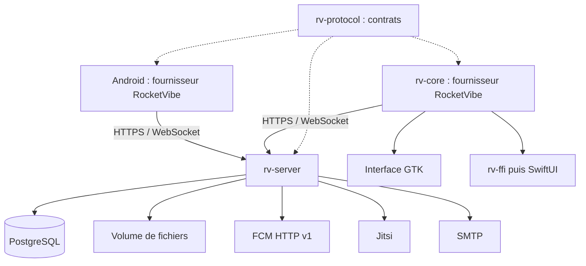

# RFC 0001 — Serveur RocketVibe autonome en Rust

| Métadonnée | Valeur |
|---|---|
| Statut | Socle J0/J1 engagé à la demande de l'utilisateur ; décisions ouvertes au §18 |
| Date | 30 septembre 2026 |
| Périmètre | Serveur, protocole, clients Android / GTK / SwiftUI, migration Rocket.Chat |
| État du dépôt étudié | `master`, commit `39b513a` ; Android `0.4.0`, bureau `0.5.0` |
| Destination | Parité avec les fonctionnalités actuelles, fonctionnement sans serveur Rocket.Chat |

## 1. Résumé

Ajouter au monorepo un serveur de messagerie RocketVibe en Rust, auto-hébergeable,
avec une API HTTP et un protocole WebSocket propres. Les clients existants accèdent
à ce serveur par un nouveau fournisseur `rocketvibe`, tout en conservant le
fournisseur Rocket.Chat. Les deux restent utilisables dans la même application,
par compte, y compris après la transition.

**Contrainte d'interface :** les clients bureau et mobile conservent leurs écrans
et composants actuels. Le fournisseur change le transport, les données et les
capacités ; il ne crée pas de nouveau client ni de messagerie parallèle.

Le serveur utilise Axum, Tokio et PostgreSQL via SQLx. Il porte les comptes, les
permissions, les salons, les messages, les fichiers, le journal de synchronisation
et les tâches de notification. Jitsi reste le moteur d'appel ; FCM reste le canal
push Android. Leur configuration devient indépendante de Rocket.Chat.

L'interface, le cache SQLite, les brouillons, les lecteurs multimédias et le
fonctionnement hors ligne restent dans les clients. Un contrat de protocole partagé
réduit les divergences entre le serveur Rust, le cœur bureau Rust et Android.

La livraison procède par jalons. Un premier échange Android ↔ Windows après coupure
et redémarrage valide le socle, mais ne constitue pas la parité finale. Le chiffrement,
les notifications et l'import font partie de la destination obligatoire avant la
bascule d'une installation qui les utilise.

## 2. Problème et objectifs

RocketVibe dispose de clients utilisables, mais leurs fonctions dépendent des API,
documents, réglages et événements Rocket.Chat. L'hébergement, les évolutions du
protocole et une partie des comportements de synchronisation restent imposés par
ce serveur.

### Objectifs

1. Faire fonctionner les apps sans Rocket.Chat ni MongoDB dans le déploiement natif.
2. Conserver les usages couverts par la matrice fonctionnelle du §4.
3. Garantir la reprise après coupure, crash et redémarrage sans perte de message
   acquitté ni duplication d'une même intention d'envoi.
4. Garder les données, sauvegardes et paramètres sous le contrôle de l'administrateur.
5. Permettre une transition progressive et une importation contrôlée de l'existant.
6. Fournir les moyens de créer des comptes et des salons sur une installation neuve.

### Hors périmètre de cette RFC

- Compatibilité générale avec les clients officiels ou les extensions Rocket.Chat.
- Fédération entre serveurs, marketplace, omnichannel et annuaire d'entreprise.
- Client web de messagerie et console d'administration web complète.
- Livraison iOS, actuellement non validée dans le projet.
- Cluster distribué et déploiement à plusieurs régions dès la première version.
- Réimplémentation d'un moteur de visioconférence ou suppression de FCM.

Une instance héberge un espace de travail. Plusieurs instances peuvent cohabiter
dans une app. Le multi-serveur client n'implique pas un serveur SaaS multi-tenant.

## 3. État réel du dépôt et points de réutilisation

Les constats ci-dessous proviennent d'une lecture du dépôt, pas d'une nouvelle
exécution des apps. Les changelogs récents et le suivi de parité priment sur les
sections anciennes des README et de la roadmap.

| Composant | Constat | Conséquence |
|---|---|---|
| Mobile : `lib/fournisseur.ts` | Interfaces `Fournisseur`, `Traducteur`, `Listener`, actions et outboxes ; `Genre` ne contient que `rocketchat` | Étendre une séparation déjà commencée |
| Mobile : `fournisseurs/rocketchat/` | Premier adaptateur concret | Préserver son comportement et ses tests |
| Mobile : auth, profils, présence, push, E2EE et plusieurs écrans | Appels Rocket.Chat encore directs | Compléter le contrat ; ajouter un driver ne suffit pas |
| Bureau : `rv-core` | Cœur sans UI, Rust, Tokio, HTTP, WebSocket, SQLite | Introduire les fournisseurs dans le cœur ; ne pas déplacer le réseau dans GTK |
| Bureau : `rv-ffi`, GTK et SwiftUI | Deux interfaces utilisent le même cœur | Exposer les capacités et les nouveaux parcours par `rv-ffi` |
| Normalisation / rendu | Certains modèles locaux et arbres Markdown restent marqués par Rocket.Chat | Traduire aux frontières et neutraliser progressivement les formes internes |
| E2EE existant | Lecture et écriture avec des clés existantes ; création de salon chiffré absente | Ajouter un cycle complet des clés pour être autonome |
| Déploiement actuel | Rocket.Chat + MongoDB dans `docker/compose.yml` | Ajouter un Compose natif distinct ; garder le banc Rocket.Chat |

Les commentaires mentionnant kChat / Mattermost décrivent une intention
d'extension, pas un deuxième fournisseur livré. Ils ne constituent pas une
dépendance du serveur proposé.

## 4. Matrice de parité cible

Tous les éléments « parité » ci-dessous doivent être disponibles sur le fournisseur
RocketVibe à la sortie finale. Leur affectation à un jalon n'autorise pas leur abandon.

| Domaine | Serveur natif | Travail client | Cible |
|---|---|---|---|
| Découverte, comptes et sessions | Identité d'instance, connexion, sessions révocables, capacités | Nouvelle sonde et sélection de fournisseur | Parité |
| 2FA | TOTP, codes email ; réauthentification pour opérations sensibles | Parcours adaptés au défi natif | Parité d'usage, sans reproduire le digest mot de passe Rocket.Chat |
| Multi-serveurs | Identité stable de l'instance | Registres, sessions et caches isolés | Parité |
| Salons publics / privés et DM | Membres, rôles, informations, DM unique par paire | Liste, rejoindre, ouvrir un DM | Parité |
| Favoris, non-lus, mentions | Préférences personnelles, positions de lecture, compteurs | Sections, badges, navigation aux non-lus | Parité |
| Historique et temps réel | Pagination, journal durable, créations / modifications / suppressions | Traduction, cache, reprise | Parité |
| Markdown, emojis, mentions, citations | Texte source, références, catalogue d'emojis, messages système structurés | Rendu natif et normalisation | Parité |
| Envoi et brouillons | Envoi idempotent, résultat retrouvable | Outbox persistante ; brouillons locaux | Parité |
| Édition / suppression | Autorisations, délai d'édition, révisions, tombstones | Actions et états d'échec | Parité |
| Réactions, épingles, messages favoris | Opérations idempotentes ; favoris privés à l'utilisateur | Actions, listes et retour au message | Parité |
| Fils | Racine, réponses, compteurs, droits du salon parent | Vue et composer de fil | Parité |
| Présence et saisie | États temporaires avec expiration | Indicateurs et dégradation hors connexion | Parité |
| Recherche | Messages en clair, utilisateurs et salons autorisés | Recherche en salon ; index local pour le chiffré | Parité adaptée à l'E2EE |
| Photos, documents, vidéos et vocaux | Uploads, confirmation idempotente, fichiers protégés | Sélection, compression, enregistrement, lecture, partage | Parité |
| Aperçus de liens / vidéos et cartes d'intégrations | Métadonnées bornées, pièces jointes structurées | Cartes et lecteurs existants | Parité de présentation ; marketplace hors périmètre |
| Profils et réglages | Identité, avatar, bio, statut, préférences | Fiches, mon profil, réglages | Parité |
| Push et notifications bureau | Registre des appareils et préférences ; FCM Android | Réception native, navigation et réponse ; notifications bureau | Parité par plateforme |
| E2EE : messages et fichiers existants | Contenus opaques, clés enveloppées et versions | Lecture, envoi, édition, fils, verrouillage | Parité |
| E2EE : installation neuve | Registre de clés et gestion des adhésions | Initialisation, partage et renouvellement des clés | Ajout indispensable à l'autonomie |
| Appels Jitsi | Création, contrôle d'accès, réunions et jetons | Démarrer, rejoindre, informations de réunion | Parité |
| Partage et liens profonds | Identifiants et permaliens natifs | Partage Android, collage / dépôt bureau, résolution des liens | Parité |
| Langues, ergonomie, mises à jour | Capacités et erreurs structurées | FR / EN, raccourcis, correcteur, mise à jour des apps | Préserver les fonctions propres aux plateformes |
| Administration minimale | Bootstrap, invitations, désactivation, création de salons, réglages et audit | CLI opérateur ; écrans de création nécessaires | Ajout indispensable à l'autonomie |

La parité concerne le service rendu, pas les noms d'endpoints ni les anomalies du
serveur précédent. Exemple : une confirmation d'upload rejouée doit être idempotente.

Les différences de plateformes restent explicites : Linux quitte actuellement à la
fermeture ; le bureau ne reçoit pas de push quand son processus est arrêté ; SwiftUI
a encore des écarts de mise à jour et d'arrière-plan. Cette RFC ne les déclare pas résolus.

## 5. Choix proposés et alternatives

| ID | Proposition | Justification |
|---|---|---|
| D01 | Serveur Rust, Axum / Tokio / SQLx | Cohérence avec le cœur bureau, types explicites, contrôle des ressources |
| D02 | API HTTP + WebSocket RocketVibe versionnée | Maîtriser la synchronisation sans réimplémenter le DDP et les conventions Rocket.Chat |
| D03 | Monolithe modulaire, un processus applicatif | Exploitation simple ; tâches de fond durables dans PostgreSQL |
| D04 | PostgreSQL comme base autoritative | Transactions, contraintes, journal, recherche textuelle initiale |
| D05 | Fichiers sur volume local au départ | Déploiement simple ; interface interne permettant un stockage objet ultérieur |
| D06 | Jitsi et FCM conservés | Réutiliser les parcours existants et les transports spécialisés |
| D07 | Fournisseurs natif et Rocket.Chat coexistants | Migrer progressivement et conserver un point de comparaison |
| D08 | E2EE côté clients, jamais de clé de déchiffrement en clair côté serveur | Préserver la confidentialité du contenu |
| D09 | Import contrôlé, sans pont bidirectionnel permanent | Réduire les conflits et rendre la bascule vérifiable |

Ces choix sont des recommandations soumises à discussion. Les versions des
dépendances seront fixées à l'implémentation sur des versions publiées, avec lockfile,
toolchain et vérification des licences ; aucune branche de développement n'est requise.

### Alternatives considérées

**TypeScript / Node.** Bon choix pour assembler rapidement une API et profiter de
SDK, mais moins cohérent ici avec le cœur bureau Rust. Rust ne garantit pas à lui
seul la fiabilité : les transactions et les règles de reprise restent indispensables.

**Façade compatible Rocket.Chat.** Réduit certains changements clients, mais impose
les documents, streams, réglages et erreurs du serveur précédent. Une façade limitée
pourrait être étudiée séparément si conserver de vieux binaires devenait obligatoire.
Les anciens clients ne pourront pas se connecter directement au protocole proposé.

**Serveur existant, par exemple Matrix ou Mattermost.** Pertinent si le but prioritaire
est de changer d'hébergement en minimisant le développement serveur. Cela implique
une nouvelle correspondance des fonctionnalités et garde la dépendance à un autre
produit. Le choix d'un serveur propre signifie assumer sa maintenance et son exploitation.

**SQLite serveur, Redis, moteur de recherche externe, microservices.** SQLite serait
envisageable pour une petite installation, mais PostgreSQL simplifie ici les transactions
concurrentes et les tâches durables. Les autres services ne sont ajoutés qu'après
mesure d'un besoin ; Redis n'est pas requis par les premiers jalons.

## 6. Architecture et organisation du dépôt



```text
apps/server/                       Package Rust rv-server, CLI et migrations SQL
crates/rv-protocol/                 Contrat Rust indépendant de GTK, SQLite et SQLx
docs/protocol/                     Spécification, schémas et exemples de conformité
docs/rfcs/                         Propositions d'architecture
docker/compose.rocketvibe.yml       Environnement natif, distinct du banc Rocket.Chat
scripts/                           Import et outils opérateur
apps/mobile/fournisseurs/rocketvibe/
apps/desktop/crates/rv-core/        Adaptateur natif et interface de fournisseurs
```

Le workspace bureau reste en place au départ. `rv-protocol` est un package
indépendant consommé par dépendance de chemin ; la CI vérifie chaque consommateur.
Il ne reprend pas la version produit du bureau. Regrouper les workspaces Rust est
une décision de maintenance ultérieure, pas un préalable à cette RFC.

`rv-server` contient des modules comptes, salons, messages, fichiers, synchronisation,
notifications, E2EE, appels et administration. Leur logique métier ne dépend ni d'Axum
ni des formes Rocket.Chat. Les routes valident l'entrée, appellent le domaine et
produisent les DTO du protocole. Les transactions SQL portent les invariants.

`rv-protocol` partage les types d'échanges, erreurs, capacités et versions. Les
schémas exportés servent à générer les types TypeScript et à valider les données à
l'exécution. Les exemples JSON et les fixtures de conformité sont exécutés par les
deux clients. Partager des types n'autorise pas le client à appliquer les droits serveur.

Le serveur ne dépend pas de tout `rv-core`. Les caches, sessions locales, outboxes
et moteurs de reconnexion sont des responsabilités client. Les règles réellement
communes peuvent être extraites séparément après identification.

## 7. Modèle de données et invariants

| Ensemble | Données principales |
|---|---|
| Instance | Identité stable, génération des données, version de protocole, réglages |
| Comptes | Utilisateurs, mots de passe hachés, facteurs 2FA, invitations, jetons de récupération |
| Sessions et appareils | Sessions révocables, installation, plateforme, jeton FCM, dernière activité |
| Salons et adhésions | Type, nom, topic, annonce, description, membres, rôles, favoris, lecture |
| Messages | ID, auteur, salon, racine de fil, contenu clair ou chiffré, position, révision |
| Actions | Réactions uniques, épingles, favoris personnels, suppressions |
| Fichiers | Upload, état, objet stocké, taille, type, empreinte, rattachement au message |
| Synchronisation | Compteur transactionnel, événements durables, tombstones, snapshots temporaires |
| Tâches | Push, email, aperçus, nettoyage ; tentatives, échéances, baux |
| E2EE | Identités publiques, sauvegardes chiffrées, versions de clés, enveloppes par membre |
| Exploitation | Réunions, catalogue d'emojis, opérations d'import et journal d'administration |

Invariants obligatoires :

- Identifiants opaques, représentés par des chaînes. Conserver les identifiants
  historiques quand c'est possible ; ne pas imposer UUID à tous les caches existants.
- Dates UTC en RFC 3339 ; révisions et positions longues transportées comme chaînes
  décimales pour éviter les arrondis JavaScript. Les horloges clientes ne trient pas la synchro.
- Un DM à deux est unique par paire normalisée de comptes, y compris en création concurrente.
- Une réponse de fil appartient au même salon que sa racine. Les droits viennent du salon.
- Une réaction est unique par message, compte et emoji ; son retrait répété est sans effet.
- Un favori de message est privé au compte et absent des événements envoyés aux autres.
- Les positions de lecture avancent de façon monotone par compte et salon. Une édition
  ou une réaction ne transforme pas automatiquement un ancien message en nouveau non-lu.
- Les règles sur les messages propres, ceux des autres, les salons en lecture seule et
  les délais d'édition sont vérifiées au moment de la transaction serveur.
- Les suppressions restent représentées assez longtemps pour rattraper les clients
  déconnectés ; au-delà, une reconstruction du cache est imposée.

La politique des compteurs distingue messages racines, réponses de fils et mentions.
Elle doit être documentée et testée avec les deux clients avant le jalon J2 ; son
comportement par défaut vise les badges existants, sans copier une incohérence observée.

## 8. Protocole HTTP et découverte

Une route de découverte anonyme, `GET /.well-known/rocketvibe`, expose `product`,
`instance_id`, `data_epoch`, la version serveur, les versions de protocole acceptées,
l'URL de base de l'API et les méthodes de connexion disponibles. Elle n'expose aucun secret.

Les clients sondent RocketVibe et, en l'absence d'identification native, utilisent la
sonde Rocket.Chat existante. Une incompatibilité native explicite ne doit pas provoquer
un repli silencieux vers Rocket.Chat. Les origines découvertes sont validées ; aucun
jeton n'est transféré automatiquement à une nouvelle origine.

Une instance annonce des capacités effectives : `threads`, `reactions`, `search`,
`uploads`, `typing`, `presence`, `push`, `e2ee`, `calls`, limites de fichiers et règles
d'édition. Une capacité non livrée reste désactivée dans les pilotes intermédiaires.
Les permissions propres à l'utilisateur sont récupérées après authentification.

### Surface proposée — chemins indicatifs à figer au jalon J0

| Surface `/api/v1` | Opérations |
|---|---|
| `/auth/*` | Login, défi / vérification 2FA, renouvellement, logout, récupération |
| `/me`, `/sessions`, `/devices` | Profil, préférences, sessions, appareils et push |
| `/users`, `/users/{id}` | Recherche autorisée et profils |
| `/rooms`, `/rooms/{id}` | Création, liste, informations, réglages et adhésions |
| `/direct-messages` | Ouvrir ou créer un DM de façon idempotente |
| `/rooms/{id}/messages` | Historique paginé, envoi et recherche |
| `/messages/{id}` | Lecture ciblée, édition conditionnelle et suppression |
| `/messages/{id}/replies` | Fil et réponses |
| `/messages/{id}/reactions`, `/pin`, `/star` | Actions par ajout / retrait explicites |
| `/rooms/{id}/read`, `/favorite` | Position de lecture et préférence personnelle |
| `/uploads`, `/uploads/{id}/complete`, `/files/{id}` | Préparation, transfert, confirmation et lecture |
| `/sync/*` | Snapshot initial et journal de changements |
| `/e2ee/*`, `/calls/*`, `/emoji` | Clés enveloppées, conférences, catalogue |

Les noms sont une proposition de contrat, pas une liste d'endpoints implémentés.
Le protocole distingue capacités du serveur et autorisations du compte.

Chaque erreur contient un `code` stable, un `request_id` et des détails structurés
bornés. L'UI traduit le code. `401` signifie session absente, expirée ou révoquée ;
`403` refus d'action, `409` conflit / clé idempotente réutilisée autrement, `429`
limitation avec délai de reprise. Un défi 2FA est une étape d'authentification
explicite, pas un motif de suppression d'une session existante.

Les changements compatibles sont additifs. Une rupture exige une nouvelle version
majeure du protocole, une politique de support et une migration. Un événement
obligatoire inconnu interdit d'avancer le curseur : le client demande une mise à jour.

## 9. Temps réel, reprise et ordre des événements

### 9.1 Journal autoritatif

Le WebSocket est un accélérateur de livraison ; PostgreSQL et le journal durable
restent l'autorité. Le message et son événement sont enregistrés dans la même
transaction. Le serveur ne répond « envoyé » qu'après commit.

Un compteur SQL ordinaire (`BIGSERIAL`) ne garantit pas l'ordre des commits : une
transaction peut obtenir une petite position puis terminer après la suivante.
La première implémentation propose un séquenceur transactionnel d'instance :

1. Prendre les verrous métier dans un ordre documenté et appliquer l'opération.
2. Verrouiller la ligne du séquenceur, allouer les positions et insérer les événements.
3. Ne plus acquérir de verrou métier après le séquenceur ; committer immédiatement.
4. Le diffuseur lit uniquement les événements committés et peut reprendre après crash.

Le verrou est tenu jusqu'au commit : un curseur publié ne peut pas dépasser un
événement encore invisible de position inférieure. Ce choix sérialise une courte
partie des écritures et devra être mesuré. Un changement futur de stratégie conserve
le contrat de reprise et nécessite les mêmes tests de concurrence.

Chaque événement contient une version, un type, un identifiant, une cible, sa
révision et les données nécessaires à la mise à jour. Les ajouts, éditions,
suppressions, droits, lectures, favoris et versions de clés sont durables.
La présence et la saisie sont temporaires, expirent et ne gonflent pas le journal.

### 9.2 Initialisation et reconnexion

Le client récupère un snapshot borné avec un watermark cohérent. La version initiale
capture, dans une même transaction à vue cohérente, les salons autorisés, adhésions,
compteurs et messages récents avec la position du journal. Si plusieurs pages sont
nécessaires, elles proviennent de ce snapshot matérialisé immuable, à durée et taille
limitées, et pas de lectures successives d'un état mouvant.

L'ancien historique est chargé séparément par pagination keyset `(position, id)`.
Les révisions empêchent une page ancienne d'écraser un événement plus récent.

Le WebSocket utilise un ticket de connexion court obtenu par HTTP authentifié,
consommable une fois, sans jeton de session durable dans l'URL. Le client présente
son curseur ; le serveur fixe une borne de rattrapage, rejoue jusqu'à cette borne,
puis continue la lecture du journal. Toute queue mémoire bornée débordée provoque
une reconnexion et une reprise, jamais l'abandon silencieux d'événements.

La livraison est **au moins une fois**. Le client applique les événements et écrit
le curseur dans la même transaction SQLite ; il déduplique par identité et révision.
Le curseur est opaque, lié au compte, à l'instance et à la génération des données.
Les nombres internes et les événements de salons inaccessibles ne sont pas exposés.

Un curseur périmé ou une restauration de sauvegarde changeant la génération provoque
`sync_reset_required`. Le client reconstruit les données serveur sans effacer les
brouillons ni les intentions d'envoi locales ; celles-ci sont ensuite réconciliées.

### 9.3 Accès et révocation

Les lectures historiques, snapshots, replays, diffusions, recherches et fichiers
appliquent les mêmes droits. Une révocation invalide les abonnements et snapshots
concernés, produit un événement minimal de retrait et fait purger le cache du salon
dans le client coopératif. Le serveur revérifie les droits avant livraison ; aucune
nouvelle charge utile du salon ne suit l'événement de révocation sur une connexion.

Les limites d'historique à l'arrivée d'un membre sont un réglage explicite. Le
chiffrement impose en plus de posséder les bonnes versions de clés.

Une révocation ne peut pas effacer les contenus déjà téléchargés sur un appareil
qui ne coopère pas. Les garanties portent sur les accès futurs et, après rotation,
sur les nouveaux contenus chiffrés.

## 10. Envoi idempotent et fichiers

### Messages et actions

Le client génère une identité d'opération persistante avant l'affichage optimiste.
Le serveur déduplique dans une contrainte SQL sur `(compte, operation_id)`, conserve
l'empreinte de la demande et le résultat. Même clé et même demande rendent le même
résultat ; même clé et demande différente produisent un conflit explicite.

Pour les messages, l'identité client est conservée ou reliée explicitement à l'ID
canonique. Après une réponse perdue, le client peut retrouver le résultat de son
opération. Une identité de message supprimé reste réservée : rejouer un ancien
envoi ne doit pas le ressusciter après nettoyage du journal.

Les éditions portent une révision attendue. Les favoris et réactions utilisent
« mettre / retirer » plutôt qu'un toggle ambigu lors d'un rejeu.

### Fichiers

1. Créer un upload autorisé pour un salon et une intention d'envoi.
2. Transférer dans un fichier temporaire avec limites de taille, délai et débit.
3. Contrôler la taille réelle et l'intégrité de transfert ; pour le clair, vérifier
   les types autorisés. Un contenu chiffré reste opaque, son MIME déclaré n'est pas une preuve.
4. Finaliser l'objet durable avant de référencer ses octets dans un message committé.
5. Confirmer idempotemment l'upload et créer le message / ses événements en transaction.

La confirmation rejouée rend le même message. Une interruption après écriture des
octets mais avant le commit SQL peut laisser un orphelin, traité par réconciliation
et nettoyage ; aucun commit réussi ne doit référencer un objet non finalisé.

Le transfert interrompu peut être recommencé sans recréer un message. Une vraie
reprise par morceaux est une optimisation ultérieure, pas une promesse de ce premier
protocole. Les clients conservent progression, retry et abandon.

Les téléchargements vérifient l'accès au salon. Les aperçus et avatars protégés ne
transmettent pas les credentials à une origine tierce. Les requêtes de métadonnées
de liens refusent réseaux privés / loopback et revérifient DNS et redirections,
avec limites de taille et de temps. Les fichiers sont diffusés en streaming.

## 11. Comptes, permissions et administration

Le bootstrap est une commande locale à usage explicite qui crée le premier
administrateur sans mot de passe par défaut. L'inscription publique est désactivée
par défaut ; les invitations rendent une installation neuve utilisable.

Proposition initiale : mots de passe stockés avec Argon2id et paramètres mesurés sur
l'hôte, sessions opaques par appareil dont les secrets sont hachés côté serveur,
expiration et renouvellement avec rotation. Le renouvellement reste compatible
avec une app longtemps hors ligne : expiration affichée clairement, outbox préservée.

TOTP, codes de secours et codes email sont pris en charge. Les codes email sont
éphémères, à usage unique et limités en tentatives / renvois. Les secrets TOTP sont
protégés par une clé opérateur distincte des données ; cette clé fait partie du
plan de sauvegarde. Réauthentifier par mot de passe n'est pas présenté comme un
second facteur indépendant.

Un changement d'email, mot de passe, facteur 2FA ou permissions sensibles exige
une session récente ou un défi explicite. La récupération de connexion ne récupère
pas automatiquement une clé E2EE perdue.

Rôles proposés : administrateur de l'instance, propriétaire / modérateur du salon,
membre. Les permissions sont des règles serveur testées, exposées au client comme
aide au rendu. Création de salon, invitation, exclusion, édition d'autrui et accès
aux fichiers sont des actions distinctes.

Une CLI opérateur couvre comptes, invitations, désactivation, salons, membres,
réglages, import et état de santé. Les parcours utilisateur de création / adhésion
doivent être disponibles dans les apps pour les droits correspondants. Une console
web complète peut venir ensuite. L'administrateur ne lit pas les salons chiffrés
par le seul fait de son rôle.

## 12. Notifications, recherche et appels

### Notifications

Chaque événement éligible produit une tâche durable dans la transaction métier.
Les workers utilisent des baux et retries bornés ; aucun envoi réseau n'est fait
dans la transaction SQL. Les appareils, préférences, mentions, présence et positions
de lecture déterminent l'éligibilité. La réponse à une notification est un envoi
normal authentifié et idempotent.

Le serveur parle FCM HTTP v1 avec des credentials opérateur. Le payload transporte
instance, salon, message et identité de notification, sans credentials ni contenu
chiffré. Pour le clair, la préférence initiale reste une notification générique avec
récupération autorisée du contenu, comme l'intention actuelle du projet.

Le module Android natif doit être adapté : type de fournisseur, session, endpoint
de récupération et format de payload, pas seulement le code TypeScript. Logout
révoque l'appareil ; les tokens invalides sont purgés. Un crash après envoi FCM mais
avant acquittement peut provoquer un rejeu : clients et notifications dédupliquent.
La réception sur un appareil ne peut pas être garantie par le serveur seul.

Les notifications bureau viennent du fournisseur temps réel pendant que l'app tourne.
La gestion d'arrière-plan reste propre à chaque plateforme.

### Recherche et rendu

PostgreSQL porte la recherche textuelle des messages en clair, avec filtre de salons
autorisés appliqué avant de rendre les résultats. Utilisateurs et salons ne révèlent
pas les espaces privés sans permission. Le serveur n'indexe pas le clair des salons E2EE.

Les clients maintiennent, après déverrouillage, un index local du contenu chiffré
disponible. L'UI précise que les résultats portent sur l'historique téléchargé.
L'index doit suivre verrouillage, suppression et politique locale de conservation.

Le protocole natif expose le texte Markdown source et les métadonnées typées, sans
dépendre du format `md` Rocket.Chat. Les renderers sont adaptés ; un corpus commun
teste citations, code, listes, mentions et emojis sur Android / GTK / SwiftUI.

### Appels

Le serveur associe une réunion Jitsi au salon, contrôle l'accès à chaque demande de
participation et émet des jetons courts limités à la réunion avec une instance Jitsi
configurée pour les vérifier. Le lien public ne contient pas le jeton du participant.
Secrets et création des conférences appartiennent au serveur.

L'expiration d'un jeton ne garantit pas l'expulsion d'un participant déjà connecté :
ce comportement devra être vérifié avec Jitsi et sa modération. Le chiffrement des
messages ne signifie pas que les médias d'appel sont chiffrés de bout en bout ;
aucune promesse commune n'est faite sans validation spécifique.

## 13. Chiffrement de bout en bout

### Ce qui existe et ce qui manque

Le mobile et le bureau savent utiliser les formats historiques Rocket.Chat, ouvrir
des clés privées protégées, lire des clés de salon enveloppées et chiffrer messages
et fichiers. Ils ne fournissent pas encore un cycle autonome complet de création et
partage des clés. Déplacer `e2e.fetchMyKeys` dans un nouveau serveur est insuffisant.

### Exigences de la cible

- Les clients génèrent les clés ; le serveur ne reçoit jamais clé privée, clé de
  salon ou mot de passe E2EE en clair.
- Le serveur stocke des clés publiques, sauvegardes privées chiffrées et enveloppes
  de clés de salon pour les seuls destinataires autorisés.
- L'initialisation, les nouveaux appareils, la récupération par secret utilisateur,
  l'ajout de membre et la rotation à son retrait ont des parcours explicites.
- Les clés sont versionnées : une rotation ne détruit pas celles nécessaires à
  l'historique autorisé ; les anciens membres n'obtiennent pas les nouvelles clés.
- Un envoi verrouillé attend. Une rotation rend un envoi préparé avec une ancienne
  version obsolète ; le client le rechiffre avec une nouvelle identité d'opération
  si l'ancienne demande a été refusée, après vérification de son résultat.
- Les formats natifs utilisent du chiffrement authentifié et des bibliothèques
  établies. Les formats hérités restent réservés à la compatibilité / migration.
- Ni texte, nom de fichier chiffré, clé ni contenu déchiffré ne partent dans les logs,
  aperçus serveur ou notifications. Les métadonnées nécessaires au routage restent visibles.
- Les citations et aperçus de messages chiffrés sont construits côté client après
  déchiffrement. Citer dans un autre salon ne transmet pas automatiquement le clair
  ni une clé à des membres différents ; ce partage exige une action explicite.

Le format exact, l'authentification des identités publiques, la résistance à une
substitution de clé par le serveur, les appareils perdus et la protection des
nouveaux contenus après compromission nécessitent une spécification E2EE dédiée.
Cette RFC ne revendique ni forward secrecy ni équivalence avec un protocole audité.
Le choix entre extension contrôlée du mécanisme actuel et protocole de groupe
éprouvé est ouvert et bloque la sortie complète de J4.

Les caches locaux contiennent déjà du clair après déchiffrement. Une politique
explicite de verrouillage / purge, incluant l'index de recherche, est nécessaire ;
« verrouiller » ne doit pas être présenté comme un chiffrement du disque.

### Migration chiffrée

Importer les blobs et fichiers sans les déchiffrer côté serveur. Préserver les
identités et paramètres cryptographiques historiques, notamment l'UID utilisé
comme sel par les anciennes enveloppes. Une correspondance d'ID d'affichage ne
doit pas changer implicitement ces paramètres.

Le compte reconnecté doit pouvoir ouvrir ses anciennes clés depuis un nouveau
client, pas seulement depuis un appareil disposant encore de son cache. Si la
source ne permet pas d'exporter les enveloppes et paramètres nécessaires, le salon
reste explicitement non migrable jusqu'à une procédure client autorisée. La migration
ne promet pas de restaurer un historique dont les clés sont perdues.

## 14. Adaptation des clients

### Android

Ajouter `rocketvibe` à `Genre` et au registre. Étendre le contrat aux lectures
secondaires, auth, découverte, profils, présence, emojis, push, E2EE et appels.
Le nouveau fournisseur implémente ses transports, normalisation, envoi et rattrapage.
L'UI conserve sa projection SQLite et consulte les capacités / droits neutres.

Ne pas fabriquer de faux documents Rocket.Chat dans le serveur pour satisfaire les
écrans. Neutraliser ou traduire les modèles locaux encore spécifiques, y compris
Markdown, citations, permissions, flags de salon, fichiers et erreurs.

Préserver les identités d'envoi ; remplacer progressivement l'arbitrage par dates
par les révisions natives. L'adaptateur Rocket.Chat conserve sa sémantique temporelle.
Une migration locale doit traiter historiques et outboxes déjà existants.

### Bureau et SwiftUI

Introduire une interface fournisseur dans `rv-core` : auth, actions, lectures,
synchro, fichiers et capacités. Le driver Rocket.Chat encapsule le comportement
actuel ; le driver natif consomme `rv-protocol`. Étendre `rv-ffi` pour exposer genre,
capacités et parcours nouveaux ; valider GTK et SwiftUI séparément.

### Identités et liens

Séparer les données par fournisseur, origine, instance et compte. Les sessions
anciennes sans genre restent Rocket.Chat. Une instance native remplaçant un serveur
à la même URL ne récupère pas automatiquement sa session ou ses credentials.

Les liens `rocketvibe://salon/...` restent reconnus. Les nouveaux permaliens
identifient instance et salon ; les anciens liens importés passent par la table de
correspondance. Un lien externe ne choisit pas arbitrairement une session à réutiliser.
L'URL canonique d'un service peut évoluer, mais exige une reconnexion explicite.

## 15. Import, bascule et retour arrière

L'import est un outil reprenable : source en lecture seule, manifeste, version de
source, checkpoints, empreintes et table `(source, type, id) → id natif`. Rejouer
le même lot ne crée ni compte, ni DM, ni message, ni fichier supplémentaire.

| Objet | Traitement proposé |
|---|---|
| Comptes | Préserver identités utiles ; invitations / réinitialisation de connexion par défaut |
| Sessions, 2FA et tokens push | Ne pas importer ; réauthentification et réenregistrement |
| Salons / membres / rôles | Mapping explicite, rapport des permissions non traduisibles |
| Messages / fils / citations | Conserver dates et auteurs ; reconstruire les références et compteurs |
| Réactions / épingles / favoris | Importer les états et leur portée personnelle |
| Fichiers / avatars / emojis | Copier les octets, vérifier taille et empreinte ; réécrire les références |
| Lectures / préférences | Importer les éléments disponibles et signaler les absences |
| E2EE | Importer enveloppes et blobs, préserver les paramètres cryptographiques |
| Réunions et intégrations | Conserver l'historique ; reconfigurer secrets et services séparément |

La faisabilité dépend des droits d'export et de la version source. L'outil produit
un rapport complet des omissions, jamais un succès global cachant des données perdues.

Procédure de bascule :

1. Sauvegarder la source et tester sa restauration ; identifier les comptes et salons pilotes.
2. Effectuer un import de répétition et comparer comptes, références, fichiers et exemples E2EE.
3. Valider Android, GTK et SwiftUI, y compris push natif et appareils reconnectés sans ancien cache.
4. Prévenir les utilisateurs, faire vider ou traiter leurs outboxes, passer la source
   en lecture seule et capturer un export final cohérent.
5. Importer les changements finaux ; si la source ne fournit pas de delta fiable,
   refaire une lecture cohérente avec déduplication et détection des suppressions.
6. Réconcilier, faire reconnecter les clients au nouveau fournisseur et rouvrir les écritures.
7. Conserver la source en archive jusqu'à expiration d'une période décidée avant bascule.

Avant ouverture des écritures natives, le retour vers la source reste simple.
Après, il ne suffit pas de rétablir une URL : les nouveaux messages seraient perdus.
Il faut geler les écritures natives et exporter / réconcilier leurs deltas, ou déclarer
la bascule définitive après validation. Aucun retour automatique n'est promis.

Pendant le pilote, la coexistence signifie deux comptes / services distincts, pas
une synchronisation bidirectionnelle de chaque conversation. La source de vérité
d'un salon reste unique.

## 16. Exploitation et sauvegardes

Le déploiement initial comprend le binaire serveur, PostgreSQL, un volume de fichiers
et un reverse proxy HTTPS. Jitsi est optionnel pour les jalons initiaux, obligatoire
pour une installation déclarant les appels ; SMTP est nécessaire aux parcours email.
FCM nécessite un projet et des credentials propres à l'opérateur.

Les tâches de fond résident dans PostgreSQL et tournent dans le processus serveur.
Une panne de FCM, SMTP ou Jitsi ne bloque pas l'envoi de messages ordinaires ; l'état
de la fonctionnalité concernée et les retries sont visibles dans l'exploitation.

Prévoir limites de connexions / taille / débit, file de sortie WebSocket bornée,
timeouts et quotas disque. Les appels cryptographiques coûteux et traitements
multimédias ne bloquent pas l'exécuteur async. Les migrations SQL sont explicites
et vérifiées ; démarrer plusieurs binaires ne doit pas les lancer simultanément.

Logs structurés avec identifiants de requête, sans secrets ni corps des messages.
Métriques : connexions, latences, retard de journal, retard des tâches, erreurs
d'envoi, resynchronisations, volume disque et orphelins. Readiness vérifie la base
et le schéma ; liveness ne redémarre pas en boucle le service pour une panne tierce.

La sauvegarde inclut PostgreSQL, les objets référencés, configuration, identité
d'instance et clés opérateur. Une capture en maintenance, écritures suspendues et
nettoyages arrêtés, est le premier mécanisme cohérent ; une sauvegarde en ligne
demande ensuite son propre protocole de cohérence et une répétition de restauration.

Une restauration change `data_epoch` et force les clients à réconcilier leur cache,
même si l'identité et l'URL de l'instance restent identiques. Les objectifs de perte
de données admissible et de délai de restauration sont décidés avec l'opérateur.

## 17. Jalons et critères d'acceptation

| Jalon | Livrable | Critère de sortie |
|---|---|---|
| J0 — Contrat | Schémas, erreurs, capacités, modèle de droits, corpus de rendu, backlog de parité | Rust et TypeScript lisent les mêmes fixtures ; inventaire des appels directs terminé |
| J1 — Socle utilisable | Serveur Rust, Compose, bootstrap, comptes, DM / salons, envoi, historique, journal ; drivers Android et bureau | Android et Windows échangent ; crash après commit / avant réponse et coupure ne créent pas de doublon ni de trou |
| J2 — Messagerie | Actions, fils, favoris, lectures, présence, recherche, profils, ergonomie native | Scénarios comparés sur Android, GTK et SwiftUI ; droits et changements concurrents cohérents |
| J3 — Fichiers et notifications | Uploads, vocaux, cartes, emojis, FCM, réponses, liens profonds | Confirmation perdue rejouée une fois logiquement ; push validé sur Android physique app arrêtée |
| J4 — Appels et E2EE | Jitsi, spécification crypto dédiée, création / rotation / appareils / héritage | Parcours nouveaux et importés validés ; revue crypto et vérification des garanties annoncées |
| J5 — Migration et exploitation | Import reprenable, rapport de parité, sauvegarde / restauration, déploiement pilote | Source gelée importée sans omissions non acceptées ; clients sans ancien cache lisent les données ; retour arrière documenté |

L'ordre des lots peut varier, mais J1 n'est pas une autorisation de couper Rocket.Chat.
La bascule complète exige J5 et chaque fonctionnalité utilisée de la matrice §4.
Les écrans intermédiaires affichent les capacités réellement disponibles.

### Vérifications prioritaires

- Deux envois concurrents de la même intention, réponse perdue, redémarrage des deux côtés.
- Transaction avec position attribuée avant une autre mais commit retardé ; aucun événement sauté.
- Snapshot paginé pendant arrivées, suppressions et changement de droits ; état final identique au serveur.
- Expiration du journal et restauration ; brouillons / outboxes préservés et réconciliés.
- Accès interdit à l'historique, replay, recherche, profil privé et fichier ; révocation d'une socket active.
- Création simultanée d'un DM, lecture depuis deux appareils, réaction ajoutée / retirée répétée.
- Crash aux frontières disque / SQL de l'upload, confirmation répétée et nettoyage des orphelins.
- Logout, token expiré, 2FA fausse et reprise hors ligne sans destruction de session par erreur.
- Rotation E2EE avec envoi en attente, nouveau membre, membre retiré, nouvel appareil et clé perdue.
- Import interrompu et rejoué ; intégrité fichiers et références, lecture E2EE avec cache vierge.
- Fixtures de protocole et rendu ; flows réels Android, Linux / Windows GTK et Mac SwiftUI.

CI : fmt / clippy, tests de domaine, intégration PostgreSQL, génération de schémas
sans diff, tests de conformité et E2E clients. Préserver les suites Rocket.Chat pour
détecter les régressions introduites par la séparation des fournisseurs.

Les tests de charge publient matériel, dataset, connexions et débit avec p50 / p95,
mémoire et retard de journal. Les seuils d'acceptation seront fixés après le banc J1
et le choix de la taille d'instance ; cette RFC ne prétend pas disposer de mesures.

## 18. Risques et décisions ouvertes

| Sujet | Risque / coût | Décision ou action attendue |
|---|---|---|
| Taille du produit | Une API chat simple ne couvre pas la parité | Tenir un backlog lié à chaque ligne du §4 |
| Séquenceur | Contention à forte charge | Mesurer J1 et garder l'implémentation évolutive sans changer les garanties |
| Fournisseurs clients | Appels directs et DTO Rocket.Chat oubliés | Inventaire J0, fixtures et tests de non-régression |
| E2EE | Gestion des clés incomplète, héritage fragile, modèle de confiance insuffisant | Spécification et revue dédiées avant J4 complet |
| Import | Droits source insuffisants, formats incomplets, clés absentes | Spike d'export et import de répétition avant promesse de bascule |
| FCM / Jitsi / SMTP | Dépendances et exploitation persistent | Confirmer que l'objectif est l'indépendance de Rocket.Chat, pas l'absence de tout tiers |
| Retour arrière | Écritures divergentes après ouverture du natif | Fixer le point de bascule et le traitement des nouveaux messages |
| Maintenance | Serveur, clients, sauvegardes et incidents à entretenir | Désigner le responsable de l'instance et du suivi des versions |

Questions à trancher avant ou pendant J0 :

1. Taille de l'instance, trafic et volume d'historique visés ; budgets mémoire / CPU / disque.
2. Priorité d'usage du chiffrement et formats historiques effectivement présents ; choix du protocole E2EE.
3. Hébergement prévu, SMTP, projet Firebase, instance Jitsi et gestion des secrets.
4. Source à migrer, accès d'export disponibles, conservation de l'historique et période d'archive.
5. Politique d'invitation, visibilité des profils et droits de création de salons.
6. Horizon de maintien du fournisseur Rocket.Chat et des versions de protocole natives.
7. Objectifs de sauvegarde / restauration et politique d'historique pour les nouveaux membres.

Ces réponses affinent l'implémentation et le calendrier. Elles ne sont pas remplacées
par des hypothèses présentées comme des engagements. Aucun calendrier chiffré n'est
fixé avant J0 et les spikes synchronisation / export / E2EE.

## 19. Effet de l'acceptation de la RFC

Accepter cette RFC valide la direction serveur Rust, protocole natif, coexistence
des fournisseurs et destination de parité. L'acceptation doit consigner les écarts
éventuels et les décisions ouvertes prioritaires. Elle permet ensuite d'engager J0
et J1 selon le périmètre explicitement autorisé.

Ce document seul ne déclenche ni développement, ni changement de version, ni push,
ni déploiement, ni migration de données. Les migrations locales et les opérations
de bascule doivent rester concrètes, testées et revues avec l'opérateur concerné.

## 20. Références

### Dépôt étudié

- [README du projet](../../README.md).
- [Contrat de fournisseur mobile](../../apps/mobile/lib/fournisseur.ts) et
  [registre actuel](../../apps/mobile/fournisseurs/index.ts).
- [Driver Rocket.Chat mobile](../../apps/mobile/fournisseurs/rocketchat/index.ts).
- [Outbox mobile](../../apps/mobile/lib/envoi.ts), [stockage des sessions](../../apps/mobile/lib/sessionStore.ts).
- [Crypto mobile](../../apps/mobile/lib/e2e/crypto.ts), [orchestration des clés](../../apps/mobile/lib/e2e/moteur.ts).
- [Dépendances du cœur Rust](../../apps/desktop/crates/rv-core/Cargo.toml),
  [modèles Rocket.Chat actuels](../../apps/desktop/crates/rv-core/src/normalize.rs).
- [Suivi de parité](../../apps/desktop/docs/PARITY.md),
  [variante SwiftUI](../../apps/desktop/docs/MACOS-SWIFTUI.md).
- [Changelog mobile](../../apps/mobile/CHANGELOG.md), [changelog bureau](../../apps/desktop/CHANGELOG.md).
- [Compose Rocket.Chat existant](../../docker/compose.yml), [push actuel](../PUSH.md).

### Sources techniques primaires consultées le 30 septembre 2026

- [Axum](https://github.com/tokio-rs/axum) : bibliothèque HTTP de l'écosystème Tokio.
- [SQLx](https://github.com/transact-rs/sqlx) : accès SQL async et vérification optionnelle des requêtes à la compilation.
- [RustCrypto Argon2](https://docs.rs/argon2/latest/argon2/) : hachage de mots de passe, variante Argon2id.
- [Recherche textuelle PostgreSQL](https://www.postgresql.org/docs/current/textsearch.html).
- [FCM HTTP v1](https://firebase.google.com/docs/cloud-messaging/send/v1-api).
- [Jitsi : auto-hébergement Docker et authentification](https://jitsi.github.io/handbook/docs/devops-guide/devops-guide-docker/).
